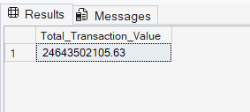
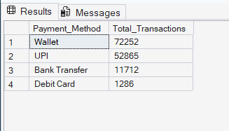
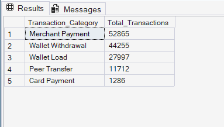
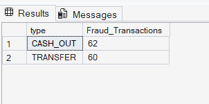
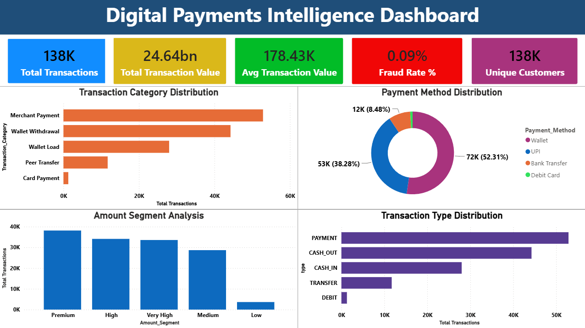
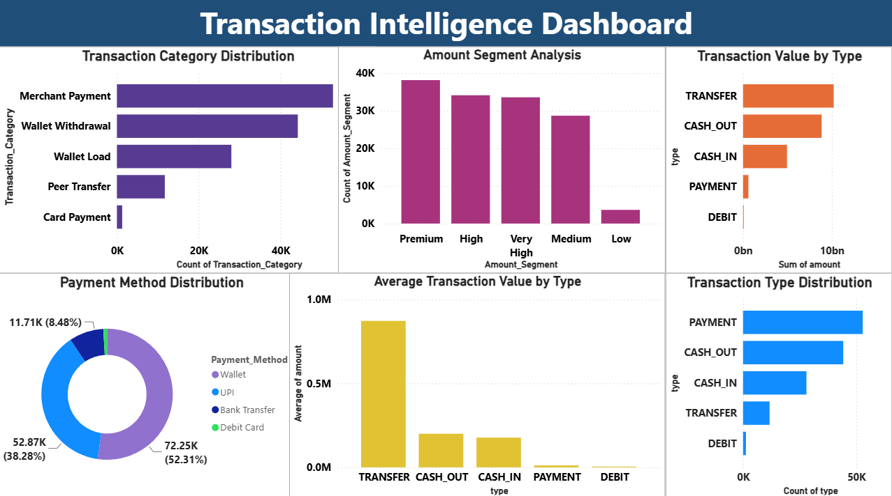
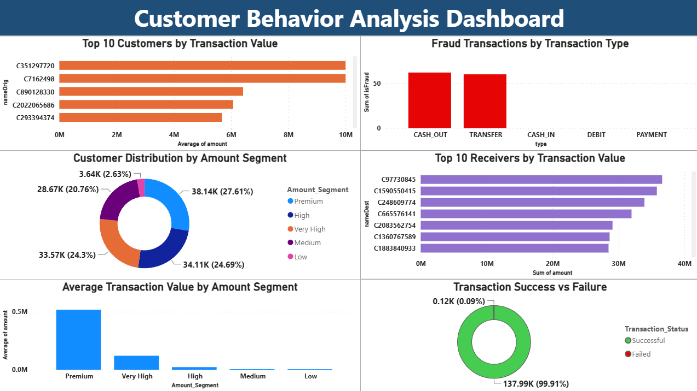
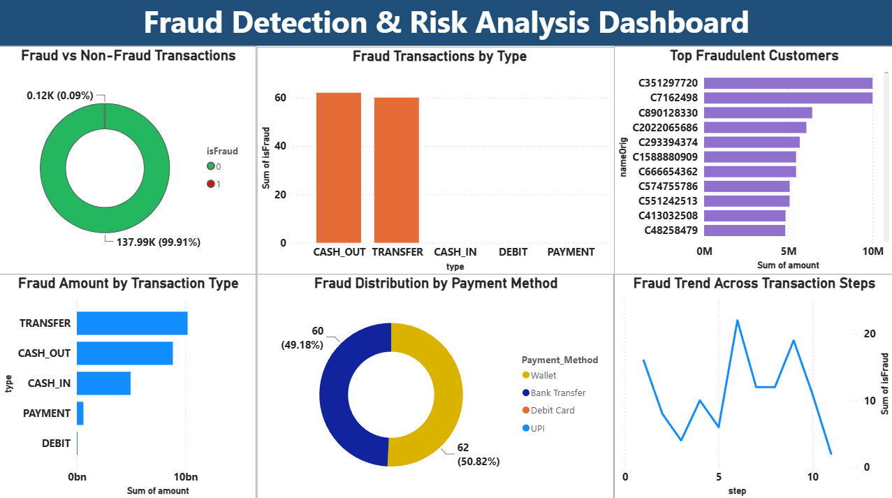
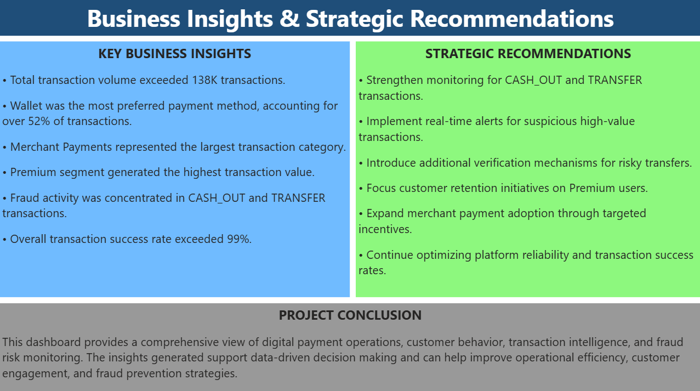

# Digital-Payments-Intelligence-Dashboard

## Project Overview

The Digital Payments Intelligence Dashboard is an end-to-end fintech data analytics project developed using Python, SQL Server, and Power BI. The project focuses on analyzing digital payment transactions to uncover transaction trends, customer behavior, fraud patterns, payment preferences, and business performance insights.

The objective of this project is to transform raw transaction data into meaningful business intelligence through data cleaning, feature engineering, SQL-based analytics, KPI development, interactive dashboards, and strategic recommendations.

This project demonstrates the complete data analytics lifecycle, starting from raw data preparation and ending with executive-level business reporting.

---

## Business Problem

Digital payment platforms process thousands of transactions every day. Understanding customer behavior, transaction patterns, fraud risks, and payment preferences is essential for improving operational efficiency and business growth.

This project addresses the following business questions:

- What are the most common transaction types?
- Which payment methods are most preferred by customers?
- Which transaction categories contribute the highest business value?
- What customer segments generate the highest transaction value?
- Which transaction types are more vulnerable to fraud?
- How can businesses improve fraud prevention and customer engagement?

---

## Dataset Information

Total Records: **138,115 Transactions**

The dataset contains transaction-related information including:

- Transaction Type
- Transaction Amount
- Customer ID
- Receiver ID
- Fraud Status
- Payment Method
- Transaction Category
- Amount Segment
- Transaction Status

---

## Tools & Technologies Used

### Programming & Data Processing
- Python
- Pandas
- NumPy

### Database
- SQL Server Management Studio (SSMS)

### Data Visualization
- Power BI

### Version Control
- GitHub

### Additional Tools
- Microsoft Excel

---

# Project Workflow

## Phase 1: Data Cleaning & Preparation (Python)

The raw transaction dataset was cleaned and transformed using Python.

### Tasks Performed

- Data exploration and inspection
- Dataset structure validation
- Missing value analysis
- Data transformation
- Data standardization
- Data preparation for SQL analysis
- Exporting cleaned dataset

### Python File

```text
Digital_payments_eda.ipynb
```

---

## Phase 2: Feature Engineering

To improve business analysis and reporting, additional analytical features were created.

### Features Created

#### Payment_Method

Classified transactions into payment methods for business reporting.

#### Transaction_Status

Created transaction status labels such as:

- Successful
- Failed

#### Transaction_Category

Grouped transactions into meaningful business categories.

#### Amount_Segment

Segmented transactions into:

- Low Value
- Medium Value
- High Value
- Premium Value

These engineered features significantly improved dashboard insights and business interpretation.

---

## Phase 3: SQL Analytics

The cleaned dataset was imported into SQL Server Management Studio (SSMS) for business analytics.

### SQL Analysis Performed

- Total Transaction Analysis
- Total Transaction Value Analysis
- Average Transaction Value Analysis
- Payment Method Distribution Analysis
- Transaction Category Analysis
- Fraud Analysis
- Customer Analysis
- Receiver Analysis
- KPI Generation

### SQL File

```text
digital_payments_queries.sql
```

---

## SQL Output Screenshots

### Total Transaction Value



### Payment Method Distribution



### Transaction Category Analysis



### Fraud Analysis



---

# Power BI Dashboard Development

An interactive Business Intelligence dashboard was developed using Power BI.

### Power BI File

```text
Digital_Payments_Intelligence_Dashboard.pbix
```

The dashboard consists of five analytical pages.

---

# Dashboard 1: Executive Overview

### KPIs

- Total Transactions
- Total Transaction Value
- Average Transaction Value
- Fraud Rate
- Unique Customers

### Visualizations

- Transaction Category Distribution
- Payment Method Distribution
- Amount Segment Analysis
- Transaction Type Distribution

### Dashboard Preview



---

# Dashboard 2: Transaction Intelligence Dashboard

### Visualizations

- Transaction Type Distribution
- Payment Method Distribution
- Amount Segment Analysis
- Transaction Value by Type
- Average Transaction Value by Type
- Transaction Category Distribution

### Dashboard Preview



---

# Dashboard 3: Customer Behavior Analysis

### Visualizations

- Top Customers by Transaction Value
- Top Receivers by Transaction Value
- Fraud Transactions by Type
- Customer Distribution by Amount Segment
- Transaction Success vs Failure
- Average Transaction Value by Amount Segment

### Dashboard Preview



---

# Dashboard 4: Fraud Detection & Risk Analysis

### Visualizations

- Fraud vs Non-Fraud Transactions
- Fraud Transactions by Type
- Fraud Amount by Transaction Type
- Fraud Distribution by Payment Method
- Fraud Trend Analysis
- Top Fraudulent Customers

### Dashboard Preview



---

# Dashboard 5: Business Insights & Strategic Recommendations

### Included Sections

- Key Business Insights
- Strategic Recommendations
- Project Conclusion

### Dashboard Preview



---

# Key Performance Indicators (KPIs)

The following KPIs were created and analyzed:

- Total Transactions
- Total Transaction Value
- Average Transaction Value
- Fraud Rate
- Transaction Success Rate
- Customer Activity Metrics
- Payment Method Performance
- Transaction Category Performance

---

# Key Business Insights

- Total transaction volume exceeded 138K transactions.
- Wallet emerged as the most preferred payment method.
- Merchant Payments represented the largest transaction category.
- Premium segment generated the highest transaction value.
- Fraud activity was primarily concentrated in CASH_OUT and TRANSFER transactions.
- Transaction success rate exceeded 99%.

---

# Fraud Detection Insights

The fraud analysis revealed:

- Fraud transactions are highly concentrated in CASH_OUT transactions.
- TRANSFER transactions also showed elevated fraud activity.
- Fraud distribution patterns can help prioritize risk monitoring.
- High-risk transaction types require additional security controls.

---

# Strategic Recommendations

Based on the analysis, the following recommendations were generated:

- Strengthen monitoring for CASH_OUT and TRANSFER transactions.
- Implement real-time fraud detection alerts.
- Introduce additional verification mechanisms for risky transfers.
- Improve fraud prevention controls for high-value transactions.
- Focus retention strategies on premium customers.
- Expand merchant payment adoption initiatives.
- Continue optimizing transaction success rates.

---

# Technical Skills Demonstrated

This project demonstrates practical experience in:

- Data Cleaning
- Data Transformation
- Exploratory Data Analysis (EDA)
- Feature Engineering
- SQL Query Writing
- Business KPI Analysis
- Fraud Detection Analytics
- Data Visualization
- Dashboard Development
- Business Intelligence Reporting
- Data Storytelling
- Insight Generation
- Business Recommendation Development

---

# Project Highlights

- Analyzed 138,115+ digital payment transactions.
- Built an end-to-end analytics pipeline using Python, SQL Server, and Power BI.
- Created custom business features through feature engineering.
- Developed five interactive Power BI dashboards.
- Performed fraud detection and risk analysis.
- Generated executive-level business insights.
- Designed strategic recommendations based on analytical findings.
- Demonstrated the complete data analytics lifecycle from raw data to business intelligence.

---

# Repository Structure

```text
digital-payments-intelligence-dashboard/
│
├── Digital_Payments_final_Dataset (1).csv
├── Digital_payments_eda.ipynb
├── Digital_Payments_Intelligence_Dashboard.pbix
├── digital_payments_queries.sql
│
├── Dashboard_1.png
├── Dashboard_2.png
├── Dashboard_3.png
├── Dashboard_4.png
├── Dashboard_5.png
│
├── Fraud_Analysis_sql_output.png
├── Total_Transaction_Value_sql_output.png
├── Transactions_Category_sql_output.png
├── Payment_Method_Distribution_sql_output.png
│
└── README.md
```
# Conclusion

The Digital Payments Intelligence Dashboard successfully demonstrates an end-to-end fintech analytics workflow involving data preparation, feature engineering, SQL-based analysis, fraud detection, KPI development, business intelligence reporting, and strategic decision support. The project converts raw transaction data into actionable business insights that can help improve operational efficiency, customer engagement, and fraud prevention strategies.

---

# Author

** M Siri Vennela**

Final Year B.Tech – Computer and Communication Engineering (CCE)

Amrita Vishwa Vidyapeetham, Chennai

GitHub: https://github.com/sirivennelamalli

